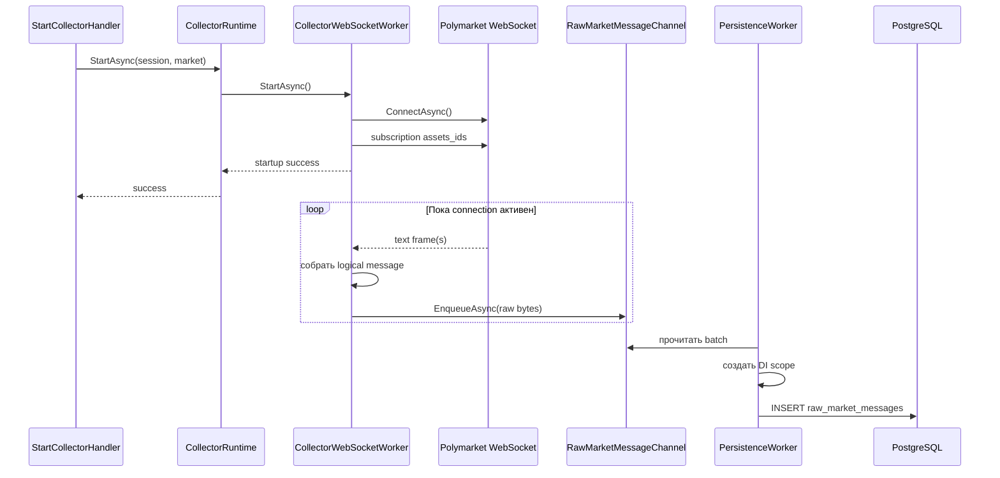
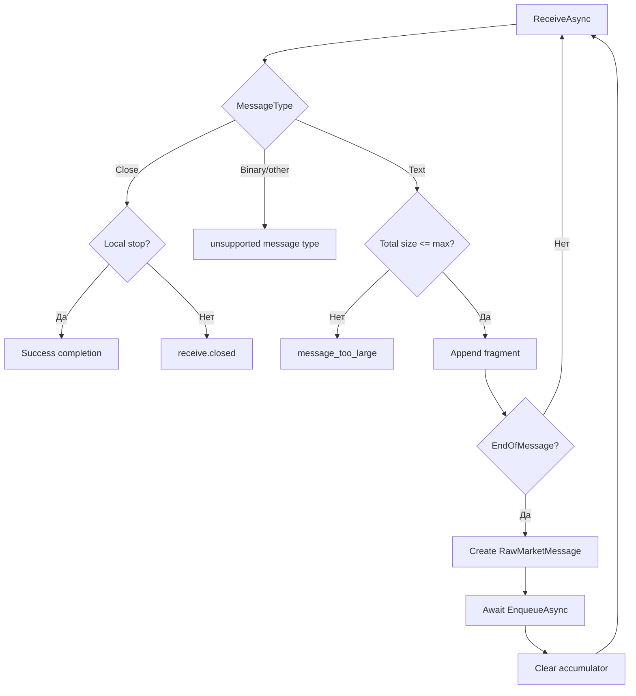
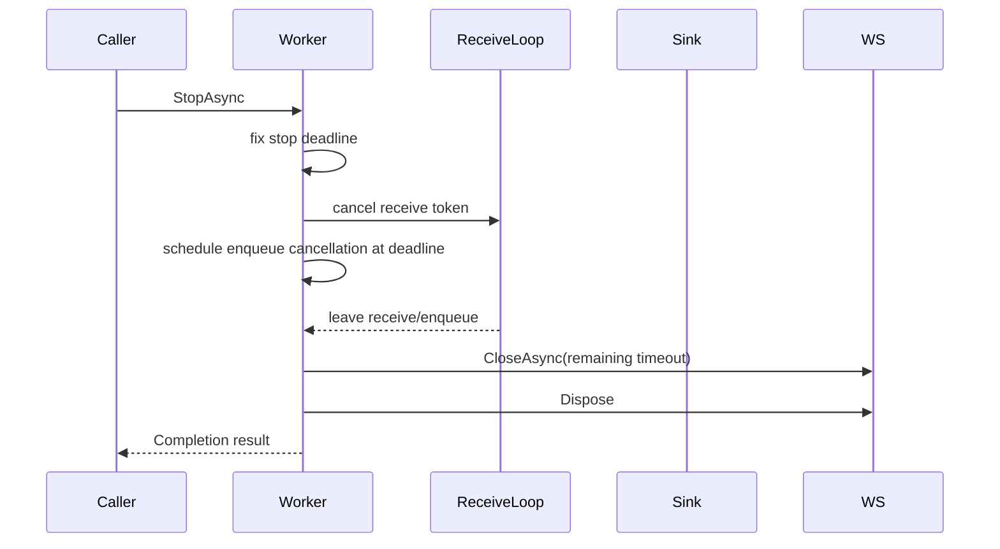
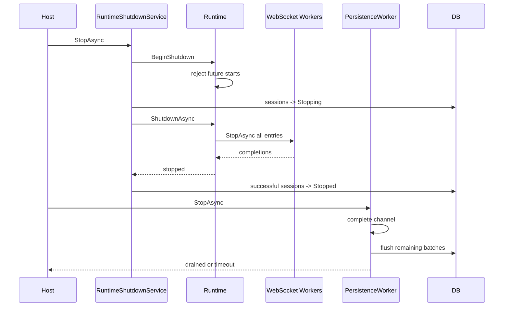
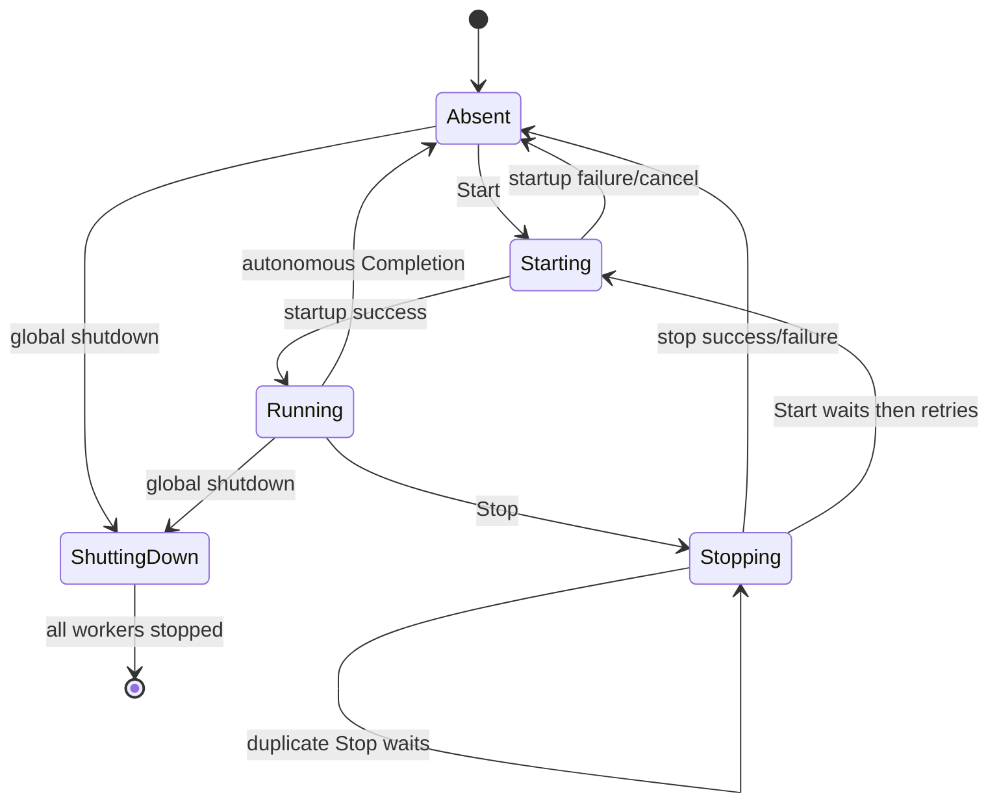
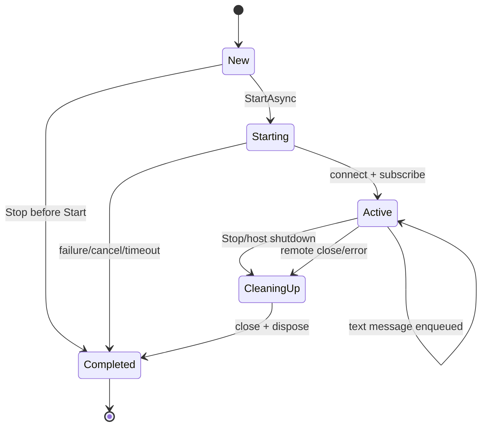

# Collector Runtime и Raw Message Ingestion

Этот документ объясняет текущую реализацию сбора сырых market-сообщений Polymarket: от запуска collector session до сохранения исходных UTF-8 bytes в PostgreSQL.

Документ рассчитан на последовательное самостоятельное изучение. Он не заменяет исходный код, а объясняет ответственность классов, жизненный цикл, конкурентные сценарии и причины принятых решений.

## Содержание

1. [Что делает подсистема](#что-делает-подсистема)
2. [Рекомендуемый маршрут чтения](#рекомендуемый-маршрут-чтения)
3. [Полный путь сообщения](#полный-путь-сообщения)
4. [Карта классов](#карта-классов)
5. [Основные термины](#основные-термины)
6. [Запуск collector](#запуск-collector)
7. [Registry и дедупликация start](#registry-и-дедупликация-start)
8. [WebSocket startup](#websocket-startup)
9. [Receive loop](#receive-loop)
10. [Fragments и лимит размера](#fragments-и-лимит-размера)
11. [Backpressure](#backpressure)
12. [Остановка worker](#остановка-worker)
13. [Completion](#completion)
14. [Автономное завершение worker](#автономное-завершение-worker)
15. [Global shutdown](#global-shutdown)
16. [Ingestion channel](#ingestion-channel)
17. [Batch persistence](#batch-persistence)
18. [PostgreSQL](#postgresql)
19. [Инварианты конкурентности](#инварианты-конкурентности)
20. [Модель ошибок](#модель-ошибок)
21. [Конфигурация](#конфигурация)
22. [DI lifetimes](#di-lifetimes)
23. [Карта тестов](#карта-тестов)
24. [Известные ограничения](#известные-ограничения)

## Что делает подсистема

Реализация состоит из двух связанных частей.

### CollectorRuntime

`CollectorRuntime` управляет WebSocket workers в памяти процесса:

- хранит не более одного runtime entry на `CollectorSessionId`;
- дедуплицирует конкурентные start и stop;
- создаёт `CollectorWebSocketWorker`;
- наблюдает долгоживущий `Completion` worker;
- удаляет завершившиеся entries;
- останавливает все активные workers при shutdown host.

### RawMessageIngestion

Raw ingestion отделяет быстрый WebSocket receive от scoped EF Core writer:

- принимает `RawMarketMessage` от всех collectors;
- помещает сообщения в bounded in-memory channel;
- применяет backpressure вместо silent drop;
- собирает сообщения в batches;
- создаёт новый DI scope и `DataCollectionDbContext` на каждый batch;
- сохраняет payload в PostgreSQL `bytea`.

> **Главная граница надёжности:** runtime и channel находятся только в памяти. PostgreSQL является первой durable boundary. Аварийное завершение процесса теряет сообщения, которые ещё не были записаны в базу.

## Рекомендуемый маршрут чтения

Лучше изучать код в следующем порядке:

1. [`ICollectorRuntime`](../../../PolymarketLab.DataCollection.Core/Ports/ICollectorRuntime.cs) и [`CollectorRuntimeStartRequest`](../../../PolymarketLab.DataCollection.Core/Ports/Dtos/CollectorRuntimeStartRequest.cs).
2. [`CollectorRuntimeEntry`](CollectorRuntimeEntry.cs), чтобы понять shared start/stop tasks.
3. [`CollectorRuntime`](CollectorRuntime.cs), чтобы понять registry и lifecycle entries.
4. [`CollectorWebSocketWorker.StartAsync`](CollectorWebSocketWorker.cs).
5. `ReceiveLoopAsync` в [`CollectorWebSocketWorker`](CollectorWebSocketWorker.cs).
6. `StopAsync`, stop deadline и cleanup в том же worker.
7. [`RawMarketMessageChannel`](../RawMessageIngestion/RawMarketMessageChannel.cs).
8. [`RawMarketMessagePersistenceWorker`](../RawMessageIngestion/RawMarketMessagePersistenceWorker.cs).
9. [`RawMarketMessageWriter`](../Postgres/Repositories/RawMarketMessage/RawMarketMessageWriter.cs) и EF mapping.
10. [`CollectorRuntimeFailureHandler`](../../../PolymarketLab.DataCollection.Core/Application/UseCases/CollectorRuntimeFailure/CollectorRuntimeFailureHandler.cs).
11. [`DataCollectionInfrastructureDependencyInjection`](../../DependencyInjection/DataCollectionInfrastructureDependencyInjection.cs).
12. Тесты в том же порядке.

Полезно одновременно держать открытыми реализацию и соответствующий test class:

- [`CollectorRuntime.cs`](CollectorRuntime.cs) и [`CollectorRuntimeStartTests.cs`](../../../PolymarketLab.DataCollection.Infrastructure.Tests/Adapters/CollectorRuntime/CollectorRuntimeStartTests.cs);
- [`CollectorWebSocketWorker.cs`](CollectorWebSocketWorker.cs) и [`CollectorWebSocketWorkerTests.cs`](../../../PolymarketLab.DataCollection.Infrastructure.Tests/Adapters/CollectorRuntime/CollectorWebSocketWorkerTests.cs);
- [`RawMarketMessagePersistenceWorker.cs`](../RawMessageIngestion/RawMarketMessagePersistenceWorker.cs) и [`RawMarketMessagePersistenceWorkerTests.cs`](../../../PolymarketLab.DataCollection.Infrastructure.Tests/Adapters/RawMessageIngestion/RawMarketMessagePersistenceWorkerTests.cs).

## Полный путь сообщения

```text
StartCollectorHandler
  -> ICollectorRuntime.StartAsync
  -> CollectorRuntime
  -> CollectorRuntimeEntry
  -> CollectorWebSocketWorker
  -> ClientWebSocketConnection
  -> Polymarket WebSocket
  -> text frames
  -> assembled UTF-8 payload
  -> RawMarketMessage
  -> IRawMarketMessageSink
  -> RawMarketMessageChannel
  -> RawMarketMessagePersistenceWorker
  -> IRawMarketMessageWriter
  -> RawMarketMessageWriter
  -> DataCollectionDbContext
  -> data_collection.raw_market_messages
```



## Карта классов

### Core contracts

| Тип | Ответственность |
|---|---|
| [`ICollectorRuntime`](../../../PolymarketLab.DataCollection.Core/Ports/ICollectorRuntime.cs) | Application-facing start/stop port |
| [`CollectorRuntimeStartRequest`](../../../PolymarketLab.DataCollection.Core/Ports/Dtos/CollectorRuntimeStartRequest.cs) | Session ID и snapshot рынка с tokens |
| [`IRawMarketMessageSink`](../../../PolymarketLab.DataCollection.Core/Ports/IRawMarketMessageSink.cs) | Producer-side enqueue port |
| [`RawMarketMessage`](../../../PolymarketLab.DataCollection.Core/Ports/Dtos/RawMarketMessage.cs) | Session ID, receive timestamp и payload |
| [`IRawMarketMessageWriter`](../../../PolymarketLab.DataCollection.Core/Ports/IRawMarketMessageWriter.cs) | Batch persistence port |

### Runtime orchestration

| Тип | Ответственность |
|---|---|
| [`CollectorRuntime`](CollectorRuntime.cs) | Singleton registry entries по `CollectorSessionId` |
| [`CollectorRuntimeEntry`](CollectorRuntimeEntry.cs) | Синхронизация start, stop и completion одного worker |
| [`ICollectorWorker`](ICollectorWorker.cs) | Внутренний lifecycle contract |
| [`ICollectorWorkerFactory`](ICollectorWorkerFactory.cs) | Создание worker для request |
| [`CollectorWebSocketWorkerFactory`](CollectorWebSocketWorkerFactory.cs) | Сборка worker из singleton DI dependencies |
| [`CollectorRuntimeShutdownService`](CollectorRuntimeShutdownService.cs) | Остановка runtime при shutdown host |
| [`CollectorRuntimeFailureDispatcher`](CollectorRuntimeFailureDispatcher.cs) | Создание scope и передача autonomous failure в Application |
| [`CollectorRuntimeErrors`](CollectorRuntimeErrors.cs) | Стабильные runtime error codes |

### WebSocket transport

| Тип | Ответственность |
|---|---|
| [`CollectorWebSocketWorker`](CollectorWebSocketWorker.cs) | Connect, subscribe, receive, assemble, enqueue, close |
| [`ICollectorWebSocketFactory`](WebSockets/ICollectorWebSocketFactory.cs) | Тестируемая фабрика connections |
| [`ICollectorWebSocketConnection`](WebSockets/ICollectorWebSocketConnection.cs) | Transport abstraction |
| [`ClientWebSocketFactory`](WebSockets/ClientWebSocketFactory.cs) | Production factory |
| [`ClientWebSocketConnection`](WebSockets/ClientWebSocketConnection.cs) | Adapter над `ClientWebSocket` |
| [`CollectorWebSocketReceiveResult`](WebSockets/CollectorWebSocketReceiveResult.cs) | Минимальный результат одного receive call |

### Ingestion и PostgreSQL

| Тип | Ответственность |
|---|---|
| [`RawMarketMessageChannel`](../RawMessageIngestion/RawMarketMessageChannel.cs) | Bounded multi-producer/single-consumer queue |
| [`RawMarketMessagePersistenceWorker`](../RawMessageIngestion/RawMarketMessagePersistenceWorker.cs) | Batching, scopes и persistence |
| [`RawMarketMessageWriter`](../Postgres/Repositories/RawMarketMessage/RawMarketMessageWriter.cs) | DTO -> EF records -> `SaveChangesAsync` |
| [`RawMarketMessageRecord`](../Postgres/Models/RawMarketMessageRecord.cs) | Persistence-only EF model |
| [`RawMarketMessageConfiguration`](../Postgres/Configurations/RawMarketMessageConfiguration.cs) | Table, columns, FK и index |

## Основные термины

### CollectorSessionId

Registry key — `CollectorSessionId`, а не `MarketId`.

Application layer отдельно обеспечивает не более одной active persisted session на market. Runtime знает только session ID и не проверяет уникальность market.

### Frame и message

WebSocket frame — часть transport protocol. Одно logical WebSocket message может состоять из нескольких frames.

В PostgreSQL сохраняется одно полное logical text message после сборки всех fragments, а не отдельные frames.

### RawMarketMessage

```csharp
public sealed record RawMarketMessage(
    CollectorSessionId SessionId,
    DateTimeOffset ReceivedAt,
    byte[] Payload);
```

`Payload` — исходные bytes text message. Runtime не выполняет JSON parsing, schema validation или domain mapping.

### Start result, Stop result и Completion

Это три разных результата:

| Результат | Что означает |
|---|---|
| `StartAsync` | Connection установлен и subscription отправлена |
| `StopAsync` | Запрошенная остановка завершилась или исчерпала deadline |
| `Completion` | Весь долгоживущий lifecycle worker завершён |

> **Важно:** успешный `StartAsync` не гарантирует, что server семантически принял subscription, что будет получено хотя бы одно сообщение или что connection не завершится сразу после start.

## Запуск collector

Application flow находится в [`StartCollectorHandler`](../../../PolymarketLab.DataCollection.Core/Application/UseCases/Commands/StartCollector/StartCollectorHandler.cs).

Упрощённая последовательность:

1. Валидировать command.
2. Загрузить market и token IDs.
3. Проверить отсутствие active session.
4. Создать persisted `CollectorSession` со статусом `Starting`.
5. Вызвать `ICollectorRuntime.StartAsync`.
6. После startup success перевести session в `Running`.
7. При startup failure перевести session в `Failed`.
8. При ошибке сохранения `Running` остановить уже запущенный runtime как compensation.

DataCollection Application и Presentation подключены к API host. Публичные endpoints collector session:

```http
GET /api/Collector/{sessionId}
GET /api/Collector/by-market/{marketId}
POST /api/Collector
POST /api/Collector/{sessionId}/stop
```

Запуск принимает `marketId`; тело запроса остановки отсутствует.

## Registry и дедупликация start

`CollectorRuntime` хранит:

```csharp
ConcurrentDictionary<CollectorSessionId, Lazy<CollectorRuntimeEntry>>
```

`Lazy` использует `LazyThreadSafetyMode.ExecutionAndPublication`. При конкурентном `GetOrAdd` только winning `Lazy` создаёт worker.

### Owner и duplicate caller

Первый caller, создавший shared start task, становится owner.

Owner token передаётся в реальный worker startup. Duplicate callers ожидают тот же shared task через `WaitAsync(duplicateToken)`.

Следствия:

- отмена duplicate caller прекращает только его ожидание;
- отмена duplicate не останавливает worker;
- отмена owner во время startup отменяет реальный startup;
- все concurrent callers получают один и тот же функциональный результат startup.

### Почему entry хранит shared tasks

Без `CollectorRuntimeEntry` два caller могли бы одновременно:

- создать два sockets;
- отправить две subscriptions;
- запустить два receive loops для одной session.

Entry сериализует переходы и возвращает уже созданный task повторным callers.

## WebSocket startup

`CollectorWebSocketWorker.StartAsync` выполняет следующие шаги:

1. Помечает, что start был вызван.
2. Проверяет, не был ли stop запрошен раньше start.
3. Проверяет absolute `ws`/`wss` endpoint.
4. Создаёт startup token из caller token и application receive token.
5. Добавляет `ConnectTimeout`.
6. Создаёт connection через factory.
7. Вызывает `ConnectAsync`.
8. Формирует subscription JSON.
9. Отправляет subscription как завершённое text message.
10. Под lock передаёт connection из startup ownership в active ownership.
11. Запускает долгоживущий `RunConnectionAsync`.
12. Возвращает startup success.

Subscription имеет вид:

```json
{
  "assets_ids": ["<token-1>", "<token-2>"],
  "type": "market",
  "custom_feature_enabled": true
}
```

### Ownership connection во время startup

Worker явно различает:

- `_startupConnection` — connect/send ещё не завершены;
- `_activeConnection` — connection передан receive lifecycle;
- local `connection` — временное владение внутри `StartAsync`.

Это нужно для stop/start races. Если startup игнорирует cancellation и превышает stop deadline, worker может принудительно вызвать `Dispose()` для startup connection.

### Startup failure

Completion публикуется только после попытки dispose startup connection.

Это важный порядок:

```text
ошибка startup
  -> cancel CTS
  -> dispose connection
  -> завершить Completion
  -> runtime может удалить entry
```

Если завершить `Completion` до dispose, runtime сможет создать replacement, пока старый socket ещё жив.

## Receive loop

После startup connection принадлежит `RunConnectionAsync`.

`ReceiveLoopAsync`:

1. Арендует frame buffer через `ArrayPool<byte>`.
2. Создаёт `ArrayBufferWriter<byte>` для logical message.
3. Последовательно вызывает `ReceiveAsync`.
4. Проверяет message type.
5. Проверяет суммарный размер fragments.
6. Копирует fragment в accumulator.
7. После `EndOfMessage` создаёт `RawMarketMessage`.
8. Полностью ожидает `IRawMarketMessageSink.EnqueueAsync`.
9. Очищает accumulator.
10. Возвращает pooled frame buffer в `finally`.



### Timestamp semantics

`ReceivedAt` берётся через `TimeProvider.GetUtcNow()` после получения последнего fragment и непосредственно перед enqueue.

Это:

- не server timestamp;
- не время первого fragment;
- не время PostgreSQL insert;
- локальное UTC-время завершения сборки logical message.

## Fragments и лимит размера

Production defaults:

- frame buffer: 16 KiB;
- maximum logical message: 1 MiB;
- абсолютный поддерживаемый configuration limit: 16 MiB.

Проверка выполняется до append:

```csharp
if (messageBuffer.WrittenCount > maximumSize - frame.Count)
    return MessageTooLarge(...);
```

Так учитывается сумма всех fragments, а не размер только текущего frame.

Ровно `MaximumMessageSize` bytes допустимы. Следующий byte завершает worker ошибкой.

Binary messages не сохраняются. Они считаются protocol mismatch и завершают collector.

## Backpressure

`CollectorWebSocketWorker` всегда ожидает `EnqueueAsync`.

Если channel заполнен:

1. Текущий payload остаётся в worker.
2. Worker ждёт свободное место.
3. Следующий `ReceiveAsync` не начинается.
4. Давление распространяется на socket и network stack.

Это сознательный выбор в пользу полноты raw history вместо drop-oldest/drop-newest.

### Ownership payload

Payload копируется на нескольких boundaries:

1. `ArrayBufferWriter.WrittenSpan.ToArray()` в WebSocket worker.
2. `Payload.ToArray()` при enqueue в channel.
3. `Payload.ToArray()` при создании persistence record.

Копии защищают от повторного использования pooled buffers и последующей мутации producer-ом.

Цена решения — allocations и memory bandwidth. Убирать копии можно только после введения явного ownership protocol.

## Остановка worker

Первый stop фиксирует общий deadline через `TimeProvider.GetTimestamp()`.

Один `StopTimeout` делится между:

- завершением startup;
- отменой pending receive;
- ожиданием in-flight enqueue;
- graceful WebSocket close.

### Cancellation tokens

Worker использует два token sources:

| CTS | Назначение |
|---|---|
| `_receiveCts` | Немедленно остановить получение данных после вызова `StopAsync` |
| `_enqueueCts` | Дать уже полученному payload шанс попасть в channel до stop deadline |

Оба источника отмены намеренно не связаны напрямую с `ApplicationStopping`. Остановку начинает `CollectorRuntimeShutdownService`: это не позволяет обработчикам исчезнуть из реестра до сохранения `Stopping` и сохраняет порядок «остановить сборщики, затем закрыть очередь».

### Stop во время active receive



### Stop во время startup

Stop отменяет startup token и ждёт `Completion`.

Если transport игнорирует cancellation:

1. Worker ждёт до общего deadline.
2. Вызывает `Dispose()` startup connection как abort.
3. Возвращает `collector.runtime.stop.timeout`.
4. Startup task продолжает разматывать стек и позднее завершает cleanup.

### Forced abort

По истечении deadline `AbortTimedOutConnection` вызывает `Dispose()` для active или startup connection.

Это аварийный путь. Production adapter должен корректно переносить dispose одновременно с незавершённым transport operation.

## Completion

`ICollectorWorker.Completion` — стабильный task всего lifecycle worker. Он возвращает `CollectorWorkerCompletion` с функциональным result, origin (`Startup`, `Autonomous`, `RequestedStop`, `ApplicationShutdown`) и временем обнаружения завершения.

Completion завершается success при:

- explicit stop;
- application shutdown;
- stop до start.

Completion завершается failure при:

- remote close;
- unsupported message type;
- oversized message;
- receive transport error;
- закрытом ingestion channel;
- startup failure;
- stop/close failure.

### Почему Completion нужен отдельно

`StartAsync` короткоживущий: он заканчивается сразу после connect и subscription.

Receive loop может работать часы или дни. Без отдельного `Completion` runtime не узнает, что connection автономно завершился, и навсегда оставит stale entry.

### Неожиданные exceptions

Worker является exception boundary:

- ожидаемые transport exceptions преобразуются в стабильные errors;
- неожиданные startup/receive/cleanup exceptions логируются;
- connection и CTS освобождаются в cleanup;
- Completion завершается, чтобы registry не завис.

## Автономное завершение worker

`CollectorRuntimeEntry.ObserveCompletion` разрешает установить ровно одного observer на worker completion.

Observer:

1. Ожидает worker completion.
2. Наблюдает fault/cancellation без unobserved exception.
3. Удаляет entry conditional remove-операцией.
4. Для autonomous failure передаёт session ID, timestamp и runtime error в scoped Application handler.

Application handler переводит `Starting` или `Running` session в `Failed` с `FatalWebSocketError`. Переход сохраняется compare-and-set update по ожидаемому `Status`; это не позволяет позднему `Starting -> Running` перезаписать уже сохранённый `Failed`. При concurrency conflict handler перечитывает session и повторяет переход. Terminal состояния и `Stopping` обрабатываются идемпотентно.

Если failure не удаётся сохранить из-за handler/repository error, dispatcher пишет critical log и вызывает `StopApplication()`, чтобы процесс не продолжал работу со stale `Running` session.

Conditional remove использует пару key/value:

```csharp
_entries.TryRemove(
    new KeyValuePair<CollectorSessionId, Lazy<CollectorRuntimeEntry>>(
        sessionId,
        entryHolder));
```

Это защищает replacement worker: поздний callback старого worker не может удалить новую entry с тем же session ID.

### Start рядом с autonomous completion

Возможна гонка:

1. Worker уже завершил Completion.
2. Observer ещё не успел удалить entry.
3. Приходит новый start.

`CollectorRuntimeEntry.Start` проверяет `worker.Completion.IsCompleted` и возвращает `RetryAfterCompletion`.

Runtime ждёт completion, удаляет именно старую entry и повторяет lookup. Concurrent callers снова разделяют один replacement worker.

## Global shutdown

Жизненный цикл состоит из трёх размещённых служб:

1. [`RawMarketMessagePersistenceWorker`](../RawMessageIngestion/RawMarketMessagePersistenceWorker.cs).
2. [`CollectorRuntimeShutdownService`](CollectorRuntimeShutdownService.cs).
3. [`CollectorSessionStartupReconciliationService`](CollectorSessionStartupReconciliationService.cs).

При запуске службы вызываются последовательно. Служба согласования находит сохранённые `Starting`, `Running` и `Stopping` сессии предыдущего процесса и атомарно переводит их в `Interrupted` с причиной `ProcessTerminated`. Ошибка чтения или обновления PostgreSQL прекращает запуск приложения.

Ожидаемый порядок:

```text
ApplicationStopping
  -> CollectorRuntimeShutdownService запрещает новые starts
  -> сохранённые сессии переходят в Stopping
  -> runtime останавливает активные сборщики
  -> успешно остановленные сессии переходят в Stopped/ApplicationShutdown
  -> in-flight payloads получают шанс попасть в channel
  -> RawMarketMessagePersistenceWorker закрывает channel
  -> consumer сохраняет оставшийся tail
  -> host завершает работу
```



### Почему важен порядок DI registration

Размещённые службы зарегистрированы так, чтобы приложение завершило согласование до открытия API, а при остановке прекратило работу сборщиков раньше потребителя очереди.

Нельзя без проверки переставлять registrations в [`DataCollectionInfrastructureDependencyInjection`](../../DependencyInjection/DataCollectionInfrastructureDependencyInjection.cs).

Если сначала закрыть channel, collectors получат `ChannelClosedException`, а in-flight payload может не попасть в PostgreSQL.

### ShutdownAsync runtime

`CollectorRuntime.ShutdownAsync`:

1. Сохраняет установленный `BeginShutdown` запрет новых запусков.
2. Делает snapshot текущих session IDs.
3. Параллельно вызывает shared `StopAsync`.
4. Возвращает отдельный результат остановки для каждой сессии.
5. Все последующие starts возвращают `collector.runtime.stopping`.

Повторное включение runtime после shutdown не поддерживается.

## Ingestion channel

`RawMarketMessageChannel` использует:

```csharp
new BoundedChannelOptions(capacity)
{
    FullMode = BoundedChannelFullMode.Wait,
    SingleReader = true,
    SingleWriter = false,
    AllowSynchronousContinuations = false
};
```

### Следствия настроек

| Настройка | Следствие |
|---|---|
| `Wait` | Нет silent drop, producer ждёт capacity |
| `SingleReader` | Один persistence consumer |
| `SingleWriter = false` | Одновременно работают несколько collectors |
| `AllowSynchronousContinuations = false` | Consumer continuation не выполняется внутри producer call stack |

### Ordering

Гарантируется:

- порядок сообщений одного collector;
- FIFO фактически принятых channel writes;
- последовательное чтение batches одним consumer.

Не гарантируется бизнес-порядок между разными sessions. Их writes конкурируют, и interleaving зависит от scheduler.

## Batch persistence

`RawMarketMessagePersistenceWorker` является singleton hosted consumer.

Он flush-ит batch при одном из условий:

- накоплен `BatchSize`;
- наступил очередной `FlushInterval` tick;
- channel завершён;
- host начал shutdown.

Пустой batch не вызывает writer.

### Durable progress

Для каждой collector session хранится отдельная строка
`data_collection.collector_session_progress`. `messages_received` и
`last_message_at` берутся из in-memory snapshot, а `messages_persisted`
увеличивается в одной транзакции с raw batch. Поэтому read API обычно отстаёт
от receive loop не более чем на `FlushInterval`.

При пользовательском Stop runtime сначала прекращает receive/enqueue, затем
ожидает `persisted >= enqueued`, выполняет финальный progress checkpoint и
только после этого сохраняет `Stopped`. Ошибка или timeout persistence переводит
session в `Failed/PersistenceFailure` вместо ложного `Stopped`.

После аварийного завершения `messages_persisted` сохраняется точно, а
`messages_received` является durable lower bound: хвост, оставшийся только в
памяти процесса, восстановить невозможно.

### Один pending channel wait

Consumer сохраняет не более одного pending `WaitToReadAsync` между timer ticks.

Создавать новый waiter на каждом tick нельзя: старые waiters остались бы незавершёнными и накопились бы за время работы процесса.

### Scope на каждый batch

```text
batch ready
  -> IServiceScopeFactory.CreateAsyncScope
  -> resolve IRawMarketMessageWriter
  -> WriteBatchAsync
  -> dispose scope и DbContext
```

Singleton consumer не хранит scoped `DataCollectionDbContext`.

### Persistence failure

Writer exception считается фатальной ошибкой ingestion subsystem:

1. Channel завершается с exception.
2. Заблокированные producers разблокируются ошибкой.
3. Пишется critical log.
4. Вызывается `StopApplication()`.
5. Host начинает coordinated shutdown.

Автоматический retry и dead-letter queue пока отсутствуют.

### Ingestion shutdown timeout

Consumer пытается сохранить tail не дольше `RawMessageIngestion:ShutdownTimeout`.

Если writer учитывает cancellation, текущий write отменяется. Если writer игнорирует token, host продолжает shutdown после deadline, а позднее завершение task наблюдается отдельно, чтобы избежать unobserved exception.

Уже отменённый общий токен остановки приложения не сокращает этот срок: потребитель очереди всегда получает собственное ограниченное время на сохранение остатка сообщений.

## PostgreSQL

Таблица:

```text
data_collection.raw_market_messages
-----------------------------------
id          bigint identity primary key
session_id  uuid not null
received_at timestamptz not null
payload     bytea not null
```

Индекс:

```text
(session_id, received_at, id)
```

Foreign key:

```text
session_id -> data_collection.collector_sessions.id
ON DELETE RESTRICT
```

Миграция: [`AddRawMarketMessages`](../Postgres/Migrations/20260727081457_AddRawMarketMessages.cs).

### Почему bytea, а не jsonb

`bytea` сохраняет точные исходные UTF-8 bytes.

`jsonb` нормализовал бы JSON и мог изменить форматирование, порядок ключей и представление значений. Структурированные projections можно строить отдельным pipeline позже.

### Writer

`RawMarketMessageWriter`:

1. Возвращается сразу для пустого batch.
2. Создаёт EF records.
3. Копирует payload.
4. Выполняет `AddRange`.
5. Обновляет progress каждой session.
6. Вызывает один `SaveChangesAsync` для raw rows и counters.

```text
data_collection.collector_session_progress
------------------------------------------
session_id          uuid primary key
messages_received   bigint not null
messages_persisted  bigint not null
last_message_at     timestamptz null
reconnect_count     bigint not null
```

`reconnect_count` не включает initial connect. Он предназначен для успешных
повторных connect + subscription и остаётся равным `0`, пока reconnect loop не реализован.

Это не PostgreSQL `COPY` и не специализированный bulk insert.

## Инварианты конкурентности

### Runtime invariants

1. На один `CollectorSessionId` существует не более одной текущей dictionary entry.
2. Один entry вызывает `worker.StartAsync` не более одного раза.
3. Один entry вызывает `worker.StopAsync` не более одного раза.
4. Concurrent starts разделяют один start task.
5. Concurrent stops разделяют один stop task.
6. Start во время stop ждёт старый stop и создаёт не более одного replacement.
7. Старый completion не удаляет новый entry.
8. Stop отсутствующей session возвращает success.
9. Stop failure всё равно удаляет entry и допускает replacement.
10. После global shutdown новые starts запрещены.

### Worker invariants

1. Выполняется не более одного `ReceiveAsync` на connection.
2. Receive и graceful close не выполняются параллельно в нормальном пути.
3. Connection имеет одного логического owner.
4. Completion публикуется после cleanup или после startup cleanup.
5. Первый stop задаёт общий deadline; повторный stop его не продлевает.
6. Уже собранный payload ожидает enqueue до deadline.
7. Frame buffer всегда возвращается в `ArrayPool`.

### Ingestion invariants

1. Channel bounded по количеству сообщений.
2. Сообщения не удаляются drop-policy.
3. Существует один consumer.
4. На batch создаётся отдельный scope.
5. После fatal writer exception channel больше не принимает сообщения.

### State machine runtime



### State machine worker



## Модель ошибок

| Error code | Причина |
|---|---|
| `collector.runtime.endpoint.invalid` | Endpoint не является absolute `ws`/`wss` URI |
| `collector.runtime.start.timeout` | Connect/subscription не уложились в timeout |
| `collector.runtime.start.cancelled` | Startup отменён caller, stop или shutdown |
| `collector.runtime.start.failed` | Transport или неожиданная startup ошибка |
| `collector.runtime.stop.failed` | Ошибка graceful close/cleanup |
| `collector.runtime.stop.timeout` | Общий stop deadline исчерпан |
| `collector.runtime.receive.failed` | Transport или неожиданная receive ошибка |
| `collector.runtime.receive.closed` | Remote endpoint закрыл connection |
| `collector.runtime.receive.message_type.unsupported` | Получен не text message |
| `collector.runtime.receive.message_too_large` | Logical message превысил byte limit |
| `collector.runtime.ingestion.closed` | Raw ingestion channel закрыт |
| `collector.runtime.stopping` | Start вызван после global shutdown |

Все перечисленные runtime errors имеют `ErrorType.Failure`.

### Exception semantics

Caller cancellation во время owned startup пробрасывается как `OperationCanceledException`.

Duplicate start/stop waiter cancellation отменяет только ожидание caller.

Transport failures преобразуются в `UnitResult<Error>`, чтобы application boundary получил стабильный error code.

## Конфигурация

### CollectorWebSocket

| Option | Default | Назначение |
|---|---:|---|
| `Endpoint` | `wss://ws-subscriptions-clob.polymarket.com/ws/market` | Polymarket market WebSocket |
| `ConnectTimeout` | 10 s | Connect и subscription startup |
| `StopTimeout` | 10 s | Общий stop budget |
| `ReceiveBufferSize` | 16 KiB | Размер одного rented frame buffer |
| `MaximumMessageSize` | 1 MiB | Лимит assembled logical message |
| `CustomFeatureEnabled` | `true` | Поле subscription payload |

Validation:

- endpoint должен быть absolute `ws`/`wss`;
- timeouts должны быть положительными и помещаться в timer API;
- receive buffer должен быть положительным и не превышать maximum message size;
- maximum message size не должен превышать 16 MiB.

### RawMessageIngestion

| Option | Default | Назначение |
|---|---:|---|
| `Capacity` | 10,000 | Максимум сообщений в channel |
| `BatchSize` | 500 | Максимум сообщений в одном batch |
| `FlushInterval` | 250 ms | Периодический partial-batch flush |
| `ShutdownTimeout` | 10 s | Budget на drain при host shutdown |

Validation:

- `Capacity > 0`;
- `0 < BatchSize <= Capacity`;
- интервалы положительные и поддерживаются timer API.

### CollectorLifecycle

| Option | Default | Назначение |
|---|---:|---|
| `ShutdownTimeout` | 30 s | Отдельный предел для сохранения состояний и остановки runtime |

Значение должно быть положительным, не превышать 5 минут и быть не меньше `CollectorWebSocket:StopTimeout`. Внешний токен остановки приложения не прерывает порядок завершения немедленно: каждая стадия получает собственный ограниченный срок.

Общий `HostOptions.ShutdownTimeout` вычисляется из трёх таких стадий, срока сохранения остатка очереди и дополнительного запаса. Даже если общий токен уже отменён, потребитель очереди всё равно ограничивает себя собственным сроком.

Секции отсутствуют в текущих `appsettings`, поэтому используются defaults.

Options читаются через обычный `IOptions<T>`. Hot reload уже созданных workers не реализован.

## DI lifetimes

### Singleton

| Service | Implementation |
|---|---|
| `ICollectorWebSocketFactory` | `ClientWebSocketFactory` |
| `ICollectorWorkerFactory` | `CollectorWebSocketWorkerFactory` |
| `CollectorRuntime` | concrete singleton |
| `ICollectorRuntime` | тот же `CollectorRuntime` instance |
| `RawMarketMessageChannel` | concrete singleton |
| `IRawMarketMessageSink` | тот же channel instance |
| `TimeProvider` | `TimeProvider.System`, если не переопределён |

### Scoped

| Service | Implementation |
|---|---|
| `DataCollectionDbContext` | EF Core context |
| `IRawMarketMessageWriter` | `RawMarketMessageWriter` |
| `ICollectorSessionRepository` | `CollectorSessionRepository` |
| `IMarketCollectionSource` | `MarketCollectionSource` |

### Hosted

| Service | Назначение |
|---|---|
| `RawMarketMessagePersistenceWorker` | Channel consumer и batch persistence |
| `CollectorRuntimeShutdownService` | Остановка collectors до ingestion shutdown |
| `CollectorSessionStartupReconciliationService` | Согласование сессий предыдущего процесса до открытия API |

Singleton runtime/factory не должны напрямую зависеть от scoped repository или DbContext.

## Карта тестов

### CollectorRuntimeStartTests

[`CollectorRuntimeStartTests.cs`](../../../PolymarketLab.DataCollection.Infrastructure.Tests/Adapters/CollectorRuntime/CollectorRuntimeStartTests.cs) проверяет:

- создание worker;
- concurrent start deduplication;
- повторный start после success;
- retry после startup failure;
- owner и duplicate cancellation;
- factory exception;
- stop failure и replacement;
- shared stop после caller cancellation;
- start во время stop;
- autonomous completion и replacement;
- global shutdown и запрет новых starts.

### CollectorWebSocketWorkerTests

[`CollectorWebSocketWorkerTests.cs`](../../../PolymarketLab.DataCollection.Infrastructure.Tests/Adapters/CollectorRuntime/CollectorWebSocketWorkerTests.cs) проверяет:

- subscription JSON;
- custom feature flag;
- single и fragmented text messages;
- timestamp и payload;
- binary rejection;
- oversized message;
- remote close;
- receive transport failure;
- sink backpressure;
- caller/startup/application cancellation;
- invalid endpoint;
- graceful stop;
- close timeout;
- stop/start races;
- startup, игнорирующий cancellation;
- forced abort по stop deadline.

### RawMarketMessageChannelTests

[`RawMarketMessageChannelTests.cs`](../../../PolymarketLab.DataCollection.Infrastructure.Tests/Adapters/RawMessageIngestion/RawMarketMessageChannelTests.cs) проверяет:

- FIFO;
- payload ownership;
- ожидание capacity;
- cancellation blocked producer;
- completed channel;
- multiple producers.

### RawMarketMessagePersistenceWorkerTests

[`RawMarketMessagePersistenceWorkerTests.cs`](../../../PolymarketLab.DataCollection.Infrastructure.Tests/Adapters/RawMessageIngestion/RawMarketMessagePersistenceWorkerTests.cs) проверяет:

- full-batch flush;
- interval partial flush;
- отдельный scope на batch;
- shutdown drain;
- fatal writer failure;
- cooperative cancellation;
- writer, игнорирующий cancellation.

### PostgreSQL tests

[`RawMarketMessageWriterTests.cs`](../../../PolymarketLab.DataCollection.Infrastructure.Tests/Adapters/Postgres/RawMarketMessageWriterTests.cs) проверяет writer behavior через EF InMemory.

[`DataCollectionDbContextModelTests.cs`](../../../PolymarketLab.DataCollection.Infrastructure.Tests/Adapters/Postgres/DataCollectionDbContextModelTests.cs) проверяет Npgsql metadata, types, index и FK без реального PostgreSQL.

### DI и options tests

Каталог [`DependencyInjection`](../../../PolymarketLab.DataCollection.Infrastructure.Tests/DependencyInjection) проверяет:

- defaults;
- invalid configuration boundaries;
- singleton/scoped lifetimes;
- `ValidateOnBuild` и `ValidateScopes`;
- регистрацию и порядок трёх размещённых служб.

### Что тестами не покрывается

- реальное соединение с Polymarket;
- реальный PostgreSQL;
- применение migrations к базе;
- API/Application/Runtime/PostgreSQL end-to-end;
- реальный shutdown ordering Generic Host;
- длительная нагрузка и memory pressure;
- network partitions и неоднозначный результат DB write;
- работу согласования с настоящим PostgreSQL и реальное аварийное завершение процесса.

## Известные ограничения

1. Нет reconnect, exponential backoff и повторной subscription.
2. Нет heartbeat и detection состояния «socket открыт, но данные не приходят».
3. Между автономной ошибкой обработчика и записью сессии нет надёжного сохраняемого уведомления; после сбоя остаточная активная сессия исправляется только при следующем запуске.
4. Остановка collector session опубликована только по `CollectorSessionId`, не по `MarketId`.
5. Channel in-memory: process crash теряет непросохранённый tail.
6. Shutdown timeout допускает потерю tail.
7. Нет persistence retry и dead-letter queue.
8. Нет raw-message deduplication или idempotency key.
9. Нет exactly-once guarantee.
10. Используется EF `SaveChangesAsync`, а не PostgreSQL `COPY`.
11. Capacity измеряется количеством сообщений, а не bytes.
12. При 10,000 больших сообщений channel может потреблять много памяти.
13. Payload копируется несколько раз.
14. JSON не валидируется; сохраняется любой text payload.
15. Binary message завершает collector.
16. Remote close считается failure, если local stop ещё не начался.
17. Runtime uniqueness основана на `CollectorSessionId`, не на `MarketId`.
18. Ошибка одного persistence batch останавливает всю ingestion subsystem.
19. Миграции не применяются автоматически при запуске приложения.
20. Согласование при запуске безопасно только при одном экземпляре приложения: идентификатор владельца и аренда сессии отсутствуют.

## Что делать дальше

Пользовательская остановка сборщика уже реализована:

```text
stop command
  -> active session -> Stopping
  -> CollectorRuntime.StopAsync
  -> session -> Stopped/Requested
```

Следующий этап — проектировать reconnect, повторную subscription и heartbeat.
